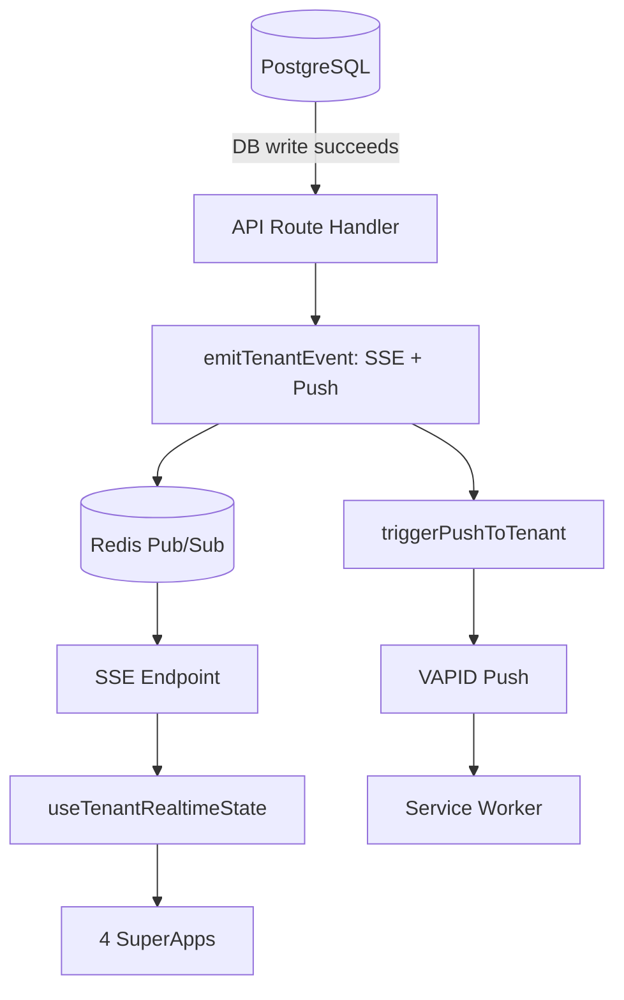

# SEU ZÉLLA — Documento Master de Conclusão V2
### Baseline · Gaps · Plano de Aceite · Níveis de Maturidade M0–M6

---

| Metadado | Detalhe |
| :--- | :--- |
| **Commit de referência** | `a0bb1a85` *(snapshot — sujeito a reconciliation)* |
| **Data** | 24 de Agosto de 2026 |
| **Versão do documento** | V2 — Reformulação estrutural |
| **Repositório** | `github.com/MarcioCau14/SmartHotel_Zehla` |
| **Produção** | `smart-hotel-zehla.vercel.app` *(READY)* |
| **Nível de maturidade atual** | M2 (Testado) — parcial M3 (Homologado) |
| **Autor** | ZéCode (DEV FULL STACK SÊNIOR) |

> [!WARNING]
> **AVISO:** Este documento é uma fotografia do sistema no commit `a0bb1a85`. Qualquer alteração posterior no repositório deve ser reconciliada antes da execução da onda seguinte. O documento será atualizado a cada onda completada.

---

## 1. Posicionamento do Documento

Este **NÃO** é um documento de conclusão definitiva. É um **Documento Master de Conclusão — Baseline + Gaps + Plano de Aceite**. Ele estabelece a baseline técnica atual, identifica gaps reais (com evidência de código), define níveis de maturidade M0–M6, e estrutura um plano de aceite que vai além do código — incluindo validação operacional, observabilidade, disaster recovery, governança LGPD e go-live business.

A versão anterior (V1) confundia código existente com funcionalidade concluída. Esta versão V2 separa explicitamente os conceitos: ter código que compila, passa testes e está deployado **NÃO** significa que a funcionalidade está operacional. Para declarar 100%, todos os gates técnicos, operacionais e de negócio devem ser aprovados.

### 1.1 Distinção Crítica: Código ≠ Conclusão Operacional

- **IMPLEMENTADO:** endpoint + código existe
- **INTEGRADO:** wired no sistema (não isolado)
- **ACEITO:** evento real ativa comportamento esperado
- **OPERACIONAL:** evento real + idempotência + retry + DB + rollback + monitoramento

> [!IMPORTANT]
> **Exemplo concreto:** o webhook Stripe tem código + HMAC + deploy, **MAS** a extração de `tenantId` do payload usa `event.raw.metadata` enquanto o Stripe coloca metadados em `raw.data.object.metadata`. O código existe, o HMAC funciona, mas a ativação de assinatura pode falhar em produção. Portanto: **IMPLEMENTADO, não OPERACIONAL**.

---

## 2. Níveis de Maturidade M0–M6

Substitui o modelo de % simples (82% → 100%). Cada setor é classificado por nível de maturidade, não por porcentagem. Um setor em M2 (Testado) pode ter 100% do código, mas ainda não foi validado em produção.

| Nível | Nome | Critério | Exemplo |
| :---: | :--- | :--- | :--- |
| **M0** | **Código** | Compila sem erros TypeScript | `tsc --noEmit = 0 errors` |
| **M1** | **Integrado** | Wired no sistema, importado por consumers | Hook importado por 4 SuperApps |
| **M2** | **Testado** | Testes unit/integration/security passando | `vitest run = 2.037 pass` |
| **M3** | **Homologado** | E2E com servidor real + DB real | `playwright test` com `E2E_TEST_PASSWORD` |
| **M4** | **Produção** | Deploy + smoke test em produção | Vercel `READY` + `/api/health ok` |
| **M5** | **Operacional** | Serviços externos + monitoramento + recovery | Redis real + alertas + backup |
| **M6** | **Comercial** | Cliente real pagando, suporte ativo | 8 pousadas reais onboardadas |

### 2.1 Nível Atual do Projeto

O projeto Seu Zélla está majoritariamente em **M2 (Testado)** com áreas parciais em **M3** (configuração E2E existe mas não executada com servidor real) e **M4** (Vercel `READY` mas sem serviços externos configurados). **Nenhum setor está em M5 ou M6.**

---

## 3. Régua Funcional Expandida (9 Níveis)

A régua V1 tinha 7 níveis. A V2 adiciona 2 níveis críticos que faltavam: **ACEITO** (comportamento esperado do produto) e **OPERACIONAL** (serviços externos + monitoramento + recovery). Sem estes, um endpoint pode passar todos os gates técnicos e ainda assim falhar em produção com cliente real.

| # | Gate | Validação |
| :-: | :--- | :--- |
| 1 | **CODIFICADO** | Código implementado e commitado no repositório |
| 2 | **INTEGRADO** | Wired no sistema, importado por consumers reais |
| 3 | **TESTADO** | Teste comportamental passando (não source-level) |
| 4 | **VALIDADO** | TypeScript 0 erros + build success + suite verde |
| 5 | **COMMITADO** | Pushed para main com author email verificado |
| 6 | **DEPLOYADO** | Vercel deployment status = success |
| 7 | **VERIFICADO** | Produção servindo o HEAD correto + `/api/health ok` |
| 8 | **ACEITO** | Fluxo passou pelo comportamento esperado do produto |
| 9 | **OPERACIONAL** | Serviços externos + credenciais + monitoramento + recovery funcionando |

### Exemplos da diferença entre VERIFICADO e OPERACIONAL:
- **Stripe:** código + HMAC + deploy (`VERIFICADO`) $\neq$ cobrança real funcionando (`OPERACIONAL`)
- **Alexa:** handler + JWT + testes (`VERIFICADO`) $\neq$ integração Alexa real (`OPERACIONAL`)
- **Redis:** wrapper + fallback (`VERIFICADO`) $\neq$ multi-instância validada (`OPERACIONAL`)
- **Push:** endpoints + VAPID code (`VERIFICADO`) $\neq$ push real em navegador (`OPERACIONAL`)
- **DDC:** página renderizando (`VERIFICADO`) $\neq$ jornada completa de cliente (`OPERACIONAL`)

---

## 4. Auditoria por Setor — Níveis de Maturidade

Cada setor é classificado pelo nível de maturidade M0–M6. A coluna *Gate bloqueador* indica qual gate precisa ser passado para avançar ao próximo nível.

| Setor | Nível | Gate bloqueador | Evidência / Gap |
| :--- | :---: | :--- | :--- |
| **Arquitetura** | M2 | M3: E2E | 23 arquivos `@ts-nocheck` (P2) |
| **Segurança / Zero Trust** | M2 | M5: Operacional | Alexa replay não wired (P0.1) |
| **Multi-tenant** | M2 | M5: Operacional | Application-level isolation (não RLS). 37 modelos fora da lista |
| **Autenticação** | M4 | M5: ZCC prod | Env-driven master admin. Validar em prod (P0.6) |
| **Cérebro / Agentes** | M2 | M5: LLM prod | 9 stages, 7 LLM providers, timeout wrapper |
| **GraphRAG / Governança** | M1 | M2: Testes sidecar | Semantica sidecar existe, wiring TS parcial |
| **LGPD (código)** | M2 | M5: Operacional | Modelos persistidos. Falta governança jurídica (Seção 7.3) |
| **Billing & Payments** | M2 | M5: Pagamento real | Stripe metadata bug (P0.4). 3 gateways HMAC |
| **DRE & Finance** | M1 | M2: Modelo financeiro | Queries reais mas OPEX hardcoded. Falta modelo operacional completo (Seção 10) |
| **Workers / BullMQ** | M2 | M5: Redis real | DLQ drainer não registrado no `vercel.json` (P0.2) |
| **Webhooks** | M2 | M5: Replay audit | HMAC em todos. Falta idempotency audit (P1.7) |
| **Fechaduras / PINs** | M2 | M5: OAuth real | Rate limit apenas em PIN gen. Locks routes sem rate limit (P0.3) |
| **Alexa / Smart Home** | M1 | M2: Wire security | Replay protection dead code (P0.1). Sem Matter/Google Home |
| **DDC Desktop Pousada** | M2 | M3: E2E jornada | Mocks removidos, hydration real. Falta validar jornada completa |
| **DDC Desktop Airbnb** | M2 | M3: E2E jornada | Idem Pousada |
| **DDC Mobile Pousada** | M2 | M3: E2E 2-device | `localStorage` residual (nome+upsell) (P2.6) |
| **DDC Mobile Airbnb** | M2 | M3: E2E 2-device | Mocks removidos, hydration real |
| **Mobile ↔ Desktop Sync** | M2 | M5: Redis multi-inst | SSE + Redis + `emitTenantEvent`. Falta validação 2-inst (P1.1) |
| **PWA** | M2 | M4: Instalação real | SW v4 + update flow. Ícones SVG placeholder (P3.1) |
| **Offline / SW** | M2 | M5: Offline real | SW registrado, cache strategies, background sync |
| **Push Notifications** | M1 | M5: VAPID real | VAPID + endpoints + hook. Pendente env vars (P1.2) |
| **Testes Unit/Integration** | M2 | M3: E2E | 2.037 passando. 24 skipped (16 RLS + 8 DB) |
| **Testes Security** | M2 | M5: Prod audit | 131 testes + canaries + endpoint audit |
| **E2E (Playwright)** | M0 | M2: Executar specs | Config + 3 specs existem. Nunca executados com servidor real (P0.5) |
| **CI/CD** | M4 | M5: Cron audit | 8 crons sem `verifyCronAuth` (corrigido). Cron órfão caution (P0.2) |
| **Vercel** | M4 | M5: Smoke test | READY (`a0bb1a85`). Env vars pendentes |
| **Hardware** | M2 | M5: OAuth callback | 5 brands OAuth real. Zero callbacks reais exercitados |
| **Piloto Real** | M0 | M6: Cliente pagante | 0/8 pousadas. Seed-beta tem 6 fictícias (P0.10) |
| **Observabilidade / SRE** | M0 | M5: Monitoring | Inexistente. Ver Seção 7.1 |
| **Backup & DR** | M0 | M5: RPO/RTO | Inexistente. Ver Seção 7.2 |
| **Go-Live Business** | M0 | M6: Comercial | Inexistente. Ver Seção 7.4 |

---

## 5. Gaps Reclassificados (P0/P1/P2/P3)

Substitui a classificação S1/S2 da V1. Os gaps são priorizados por impacto na conclusão operacional, não apenas por severidade técnica:
- **P0** = bloqueador de conclusão.
- **P1** = produção operacional.
- **P2** = qualidade arquitetural.
- **P3** = acabamento.

### 5.1 P0 — Bloqueadores de Conclusão

| # | Gap | Ação | Correção da V1 |
| :-: | :--- | :--- | :--- |
| **P0.1** | Alexa security não wired no endpoint | Importar e chamar `checkAlexaRateLimit` + `isReplay` + `markJtiUsed` | Confirmado S1 — mantido |
| **P0.2** | `vercel.json` cron `caution-auto-return` órfão | **REMOVER** entry do `vercel.json` (não criar route) | **MUDOU:** era 'criar route' → agora 'remover cron órfão' |
| **P0.3** | Locks routes sem rate limit | Adicionar `apiRatelimit` em `POST /locks`, `/unlock`, `/panic-revoke`, `DELETE /pins` | Confirmado S1 — mantido |
| **P0.4** | Stripe tenant activation bug | Corrigir extração: `raw.data.object.metadata` (não `raw.metadata`) | **NOVO:** identificado na auditoria V2 |
| **P0.5** | E2E nunca executado com servidor real | Configurar `E2E_TEST_PASSWORD` + rodar `playwright test` | Confirmado — mantido |
| **P0.6** | Auth ZCC não validada em produção | Testar login ZCC real com env vars configuradas | **NOVO:** identificado na auditoria V2 |
| **P0.7** | Isolamento real entre tenants não validado | Criar Tenant Isolation Matrix + testar cross-tenant access | Expandido: era '37 modelos' → agora 'Matrix classificada' |
| **P0.8** | Fluxo reserva → pagamento → confirmação | E2E completo com gateway sandbox | **NOVO:** identificado na auditoria V2 |
| **P0.9** | DDC Mobile ↔ Desktop em 2 sessões reais | 2 browsers + SSE + mutation → validar sync | **NOVO:** identificado na auditoria V2 |
| **P0.10**| Pelo menos 1 cliente piloto | Onboardar 1 pousada real → validar jornada | Confirmado — mantido |

### 5.2 P1 — Produção Operacional

| # | Gap | Ação |
| :-: | :--- | :--- |
| **P1.1** | Redis real (multi-instance SSE) | Provisionar Upstash + setar `REDIS_URL` + validar 2 instâncias |
| **P1.2** | Push real (VAPID) | Gerar VAPID keys + setar env vars + validar push em browser |
| **P1.3** | Backup + restore | Configurar DB backup automático + testar restore (Seção 7.2) |
| **P1.4** | Observabilidade / SRE | Error tracking + latency + alertas (Seção 7.1) |
| **P1.5** | DLQ operacional | Registrar `/api/cron/dlq-drain` no `vercel.json` + alertas |
| **P1.6** | Cron inventory audit | Auditar 28 crons — remover órfãos, validar todos com `verifyCronAuth` |
| **P1.7** | Webhook replay/idempotency audit | Auditar Asaas/MP/Stripe/WhatsApp — idempotency keys + replay protection |
| **P1.8** | LLM provider failover real | Testar fallback chain com providers reais (não mock) |
| **P1.9** | Cost monitoring | Dashboard de custo LLM por tenant + alertas de budget |
| **P1.10**| Rate limits distribuídos | Migrar rate limit in-memory → Redis (Upstash) para multi-instance |

### 5.3 P2 — Qualidade Arquitetural

| # | Gap | Ação |
| :-: | :--- | :--- |
| **P2.1** | `@ts-nocheck` (23 arquivos) | Classificar P0 (auth/billing/security) → P1 (business) → P2 (legacy). Remover P0 primeiro |
| **P2.2** | Tenant Isolation Matrix | Classificar 73 modelos: `TENANT_SCOPED` / `SYSTEM_GLOBAL` / `ZCC_GLOBAL` / `AUTH_GLOBAL` / `AUDIT_GLOBAL` / `SHARED` |
| **P2.3** | Real adapters stubs | Classificar: usados em produção (S1) vs infra futura (P2). Decidir implementar ou remover |
| **P2.4** | DRE totalmente dinâmico | Criar `OperationalCost` model + queries. Substituir `OPEX_FIXED` hardcoded (Seção 10) |
| **P2.5** | FX dinâmico (USD→BRL) | Substituir rate fixo 5.0 por API de câmbio ou env var atualizada |
| **P2.6** | `localStorage` residual Mobile | Remover `zella_pousada_nome` + `zella_pousada_upsell` de `MobilePousadaSuperApp` |

### 5.4 P3 — Acabamento

| # | Gap | Ação |
| :-: | :--- | :--- |
| **P3.1** | Ícones oficiais do Zé | Substituir SVGs placeholder 'Z' pelos arquivos oficiais |
| **P3.2** | Polimento PWA | Maskable icons, screenshots, shortcuts no manifest |
| **P3.3** | Documentação interna | README atualizado + arquitetura diagram + API docs |
| **P3.4** | Dashboard observabilidade no ZCC | Painel admin com métricas de saúde, DLQ, custos, latência |

---

## 6. Correções Específicas da V1

### 6.1 Stripe — Bug de Metadata (P0.4)
A V1 afirmava *"Stripe webhook endpoint ativo"*. A auditoria V2 descobriu que o código em `src/app/api/webhooks/stripe/route.ts` tenta extrair `tenantId` de `event.raw.metadata`, mas o Stripe coloca metadados em `raw.data.object.metadata`. O commit `a0bb1a85` corrigiu `event.event` e `event.gatewayPaymentId`, mas a lógica de tenant lookup ainda usa `subscription.findFirst` que pode não encontrar o registro correto. **Status real: IMPLEMENTADO, não OPERACIONAL.**

### 6.2 caution-auto-return — Cron Órfão (P0.2)
A V1 dizia *"criar route /api/cron/caution-auto-return"*. A V2 descobre que o recurso Caução PIX foi removido deliberadamente do projeto (commit `c4a2bdba`) porque a decisão de produto foi que caução é responsabilidade do proprietário da pousada, não do Zélla. **Ação correta: REMOVER a entry órfã do vercel.json, não recriar a route.** Isso muda completamente a solução — é cleanup de infraestrutura, não desenvolvimento.

### 6.3 Multi-tenant — Nomenclatura RLS (P2.2)
A V1 chamava *"RLS via Prisma extension"*. A V2 corrige: o mecanismo em `tenant-prisma.ts` é **application-level tenant isolation via Prisma extension** (injeção de `tenantId` nas operações ORM). **NÃO** é PostgreSQL Row Level Security real (`CREATE POLICY`, `ALTER TABLE ENABLE ROW LEVEL SECURITY`). A nomenclatura correta é *"Application-level tenant isolation"*. Se houver RLS real no DB, deve ser *"Hybrid: PostgreSQL RLS + Prisma enforcement"*.

### 6.4 Tenant Isolation Matrix — Não Adicionar Cegamente (P2.2)
A V1 sugeria *"adicionar 37 modelos ao TENANT_MODELS"*. A V2 alerta: **isso é perigoso**. Cada modelo deve ser classificado antes: `TENANT_SCOPED` (dados de tenant), `SYSTEM_GLOBAL` (config global), `ZCC_GLOBAL` (admin), `AUTH_GLOBAL` (sessões), `AUDIT_GLOBAL` (logs cross-tenant), `SHARED_REFERENCE` (dados de referência compartilhados). Adicionar cegamente pode causar comportamento incorreto em modelos que não deveriam ser scoped.

### 6.5 @ts-nocheck — Classificação (P2.1)
A V1 considerava 23 arquivos `@ts-nocheck` como bloqueador S2 para 100%. A V2 classifica:
- **P0:** `@ts-nocheck` em auth, billing, tenant isolation, security, webhooks, payments, DDC mutation, data persistence → bloqueia 100%
- **P1:** arquivos de negócio relevantes → remover antes de piloto
- **P2:** arquivos experimentais/legados → backlog (não bloqueia 100%)

### 6.6 Real Adapters — Classificação (P2.3)
A V1 listava *"8 real adapters stub"* como S2. A V2 pergunta: **estes adapters são realmente usados pelo produto em produção?** Se sim → S1 (bloqueador funcional). Se são infraestrutura futura não utilizada → P2/backlog. Esta distinção muda completamente a prioridade e deve ser respondida antes de qualquer execução.

### 6.7 DRE — Modelo Financeiro Operacional (P2.4)
A V1 dizia *"substituir OPEX_FIXED hardcoded"*. A V2 expande: não basta trocar 8.230 por uma tabela. Precisamos de um modelo financeiro operacional completo: `Receita → gateway fees → impostos → custos LLM → WhatsApp/Meta → Redis → banco → storage → Vercel → serviços externos → refunds/chargebacks → CAC/marketing = contribuição → OPEX = resultado`.

### 6.8 Status 'Pronto para Piloto' Removido
A V1 dizia *"pronto para piloto controlado (beta)"*. A V2 remove esta afirmação porque: 0/8 pousadas reais, E2E não executado, Redis pendente, VAPID pendente, gateway pendente, configuração administrativa pendente. Frase correta:
> *"O projeto possui maturidade técnica suficiente para iniciar a fase controlada de homologação, mas ainda não foi comprovado operacionalmente com cliente real."*

### 6.9 Testes — 4 Métricas (não só Vitest)
A V1 usava *"2.037 testes passando"* como indicador principal. A V2 cria 4 métricas:
1. **UNIT/INTEGRATION:** (Vitest: 2.037 pass, 24 skip)
2. **SECURITY:** (131 testes)
3. **E2E:** (0 executados — specs SKIP sem `E2E_TEST_PASSWORD`)
4. **PRODUCTION SMOKE:** (inexistente)

*100% operacional requer: Unit=verde + Integration=verde + Security=verde + E2E=verde + Smoke=verde. Vitest verde $\neq$ produto verde.*

### 6.10 Estimativas de LOC e Prazo Removidas
A V1 estimava *"12.000 LOC novas + 1-2 semanas"*. A V2 remove estimativas como fato. Frase correta:
> *"A conclusão será declarada somente após todos os gates técnicos, operacionais e de negócio serem aprovados. O cronograma será derivado da execução real das ondas e não de estimativa de LOC."* 12.000 linhas não significam nada para determinar se o produto está pronto.

---

## 7. Novos Setores Obrigatórios

### 7.1 Observabilidade / SRE (M0 → M5)
Setor inexistente no projeto. Para um SaaS multi-tenant, é obrigatório. Precisamos verificar: erros runtime, latência, falhas de webhook, falhas de cron, fila, DLQ, Redis, banco, consumo LLM, custo por tenant, taxa de erro, alertas, disponibilidade, incidentes, recovery. Ferramentas: Sentry (error tracking), Vercel Analytics (latência), Upstash alerts (Redis), custom dashboard no ZCC (custos, DLQ, health).

### 7.2 Backup & Disaster Recovery (M0 → M5)
Setor inexistente. Não basta `DATABASE_URL` configurada. Precisamos: `DB backup automático → retention policy → restore test (regular) → RPO (Recovery Point Objective) → RTO (Recovery Time Objective)`. Supabase/Neon têm backup automático, mas restore nunca foi testado. Uma aplicação que não consegue recuperar seu banco não está em 100% operacional.

### 7.3 LGPD Operacional (M2 código → M5 governança)
O código cobre boa parte da engenharia (modelos, endpoints, redactor, PII sanitizer), mas não encerra a governança jurídica/operacional. Precisamos: política de privacidade publicada, consentimento explícito coletado, política de retenção, procedimento de exclusão, exportação de dados, definição de operador/controlador, logs de acesso, incident response procedure, DPA com subprocessadores, procedimento de atendimento ao titular.

### 7.4 Go-Live Business (M0 → M6)
O maior buraco estratégico. O documento V1 terminava em *"piloto 1 → 8 → auditoria"*. A V2 cria a etapa Go-Live Business: Produto (pronto), Pricing (definido), Billing (operacional), Contrato (jurídico), Onboarding (processo), Suporte (canais), Monitoramento (alertas), LGPD (compliance), Comunicação (lançamento), Rollback (plano), Incidentes (procedure), Customer Success (onboarding ativo). Um software pode estar 100% tecnicamente concluído e 0% pronto para operar comercialmente.

---

## 8. Variáveis de Ambiente (reorganizadas com owners)

Reorganizadas em 5 blocos. Cada variável tem um 'owner' (responsável pela configuração e rotação) e um método de validação.

### 8.1 CORE — Obrigatórias

| Variável | Owner | Validação | Rotação |
| :--- | :---: | :--- | :--- |
| `NEXTAUTH_SECRET` | Auth | `/api/readiness` | Manual |
| `NEXTAUTH_URL` | Infra | `/api/readiness` | N/A |
| `ZEHLA_MASTER_ADMIN_EMAIL` | Auth | `/api/readiness` | Manual |
| `ZEHLA_MASTER_ADMIN_PASSWORD` | Auth | Login test | Manual ($\ge$12 chars) |
| `ZCC_ADMIN_EMAILS` | Auth | `/api/readiness` | Manual |

### 8.2 SECURITY — Obrigatórias

| Variável | Owner | Notas |
| :--- | :---: | :--- |
| `ALEXA_JWT_SECRET` | Security | HS256, distinto do `NEXTAUTH_SECRET`. $\ge$32 chars |
| `ENCRYPTION_SECRET` | Security | AES-256-GCM para PAT vault. $\ge$32 chars |

### 8.3 DATABASE/INFRA — Obrigatórias

| Variável | Owner | Notas |
| :--- | :---: | :--- |
| `DATABASE_URL` | Infra | PostgreSQL (Supabase/Neon). Backup automático + restore test |
| `REDIS_URL` | Infra | Upstash Redis. Obrigatório para multi-instance SSE + BullMQ |

### 8.4 INTEGRATIONS — Condicionais (1 de cada grupo)

| Variável | Owner | Grupo |
| :--- | :---: | :--- |
| `ASAAS_API_KEY` | Billing | Pagamento (1 de 3) |
| `MERCADOPAGO_ACCESS_TOKEN` | Billing | Pagamento (1 de 3) |
| `STRIPE_SECRET_KEY` + `STRIPE_WEBHOOK_SECRET` | Billing | Pagamento (1 de 3) |
| `WHATSAPP_TOKEN` + `META_APP_SECRET` | Integrations | WhatsApp (opcional) |
| `GLM_5_2_API_KEY` | AI | LLM (opcional, mock mode $0) |
| `TTLOCK`/`TUYA`/`IGLOOHOME`/`NUKI` `CLIENT_ID`+`SECRET` | IoT | Fechaduras (por brand, opcional) |

### 8.5 OPTIONAL FEATURES

| Variável | Owner | Ativa |
| :--- | :---: | :--- |
| `VAPID_PUBLIC_KEY` + `VAPID_PRIVATE_KEY` | PWA | Push notifications |
| `VAPID_SUBJECT` | PWA | Push (`mailto:`) |
| `GOOGLE_CLIENT_ID` + `SECRET` | Auth | Google OAuth login |

---

## 9. Plano de Execução (Ondas 0–5)

O plano V1 começava diretamente em 'Onda Final 1'. A V2 adiciona a **Onda 0 — Reconciliation** que deve ser executada **PRIMEIRO**. Nenhum código deve ser alterado antes da Onda 0 completar.

### 9.1 Onda 0 — Reconciliation (PRIMEIRO)
- **Objetivo:** Transformar este documento em uma especificação final confiável.
- **Não-code:** Revisão documental + auditoria profunda.
1. Reconciliar snapshot do commit (`a0bb1a85`) com estado real do repositório
2. Revisar TODOS os gaps (P0-P3) contra código real
3. Verificar funcionalidades removidas (`caution-auto-return` confirmado)
4. Verificar funcionalidades novas pós-`a0bb1a85`
5. Construir Environment Matrix com owners
6. Definir critérios de aceite operacional por setor
7. Deep audit: Stripe activation + tenant isolation (prioridade máxima)
8. Classificar real adapters: usados em produção vs futuro
9. Classificar 73 modelos Prisma (Tenant Isolation Matrix)
10. Definir RPO/RTO para backup
11. Definir procedimento de incident response
12. Definir plano de Go-Live Business

### 9.2 Onda 1 — Security (após Onda 0)
`P0.1 Alexa security wired` · `P0.2 Remover cron órfão` · `P0.3 Rate limit locks routes` · `P0.4 Corrigir Stripe metadata` · `Auth ZCC` · `Tenant isolation matrix` · `Webhook replay audit` · `Cron inventory audit` · `Rate limiting distribuído`

### 9.3 Onda 2 — Core Operational
`Stripe (sandbox)` · `Asaas` · `MercadoPago` · `Reservations flow` · `Calendar sync` · `WhatsApp` · `DDC jornada completa` · `Realtime 2-device` · `Workers`

### 9.4 Onda 3 — Infraestrutura
`PostgreSQL (provisionar + backup + restore test)` · `Redis (Upstash + multi-instance)` · `Push (VAPID)` · `Monitoring (Sentry + alerts)` · `DLQ operacional` · `Cron audit final`

### 9.5 Onda 4 — QA Real
`Unit` → `Integration` → `Security` → `E2E (com servidor real)` → `Browser` → `Production smoke` → `2-device sync` → `payment sandbox` → `webhook replay` → `rollback test`

### 9.6 Onda 5 — Piloto → Go-Live
`1 pousada real` → `validar` → `3 pousadas` → `8 pousadas` → `Go-Live Business (contrato, pricing, onboarding, suporte, comunicação, rollback, incidentes, CS)`. **Somente após todos os gates aprovados: GO-LIVE.**

---

## 10. DRE — Modelo Financeiro Operacional

Não basta substituir `OPEX_FIXED = 8230` por uma tabela. Precisamos de um modelo financeiro operacional completo que reflita os custos reais do SaaS:

| Linha | Fonte | Modelo Prisma |
| :--- | :--- | :--- |
| **Receita Bruta (MRR + Upsell)** | Subscription + UpsellRecord | Existente |
| **(-) Gateway fees** | Transaction $\times$ 3% | Calcular de Transaction |
| **(-) Impostos (Simples Nacional)** | (Receita - fees) $\times$ 6% | Calcular |
| **(-) COGS: LLM API costs** | MetaCostLog | Existente |
| **(-) COGS: WhatsApp/Meta** | WhatsApp API costs | **NEW:** `WhatsAppCostLog` model |
| **(-) COGS: Redis** | Upstash billing | **NEW:** `InfraCostLog` model |
| **(-) COGS: Database** | Supabase/Neon billing | **NEW:** `InfraCostLog` model |
| **(-) COGS: Storage** | Vercel Blob / S3 | **NEW:** `InfraCostLog` model |
| **(-) OPEX: Vercel** | Vercel Pro plan | **NEW:** `OperationalCost` model |
| **(-) OPEX: Serviços externos** | DNS, email, monitoring | **NEW:** `OperationalCost` model |
| **(-) Refunds/Chargebacks** | Transaction WHERE status=REFUNDED | Calcular de Transaction |
| **(-) CAC / Marketing** | MarketingCostLog (NEW) | **NEW:** `MarketingCostLog` model |
| **= Contribuição Marginal** | Receita - variáveis | Calcular |
| **(-) OPEX fixo** | OperationalCost | **NEW model** (substitui 8230) |
| **= Resultado Líquido** | Contribuição - OPEX | Calcular |
| **Margem Líquida %** | Resultado / Receita $\times$ 100 | Calcular |
| **FX USD→BRL** | API de câmbio ou env var | **NEW:** `ExchangeRate` util (substitui 5.0 fixo) |

---

## 11. Arquitetura Realtime (Mobile ↔ Desktop)

A arquitetura realtime da V1 está correta e coerente. Preservada nesta seção:

**Status:** M2 (Testado). **Gate para M5:** Redis real + validação multi-instância (P1.1).

---

## 12. Conclusão e Decisão

Este documento V2 corrige as 25 inconsistências identificadas na auditoria da V1. A base técnica é excelente e preservada — 30 setores auditados, gaps classificados P0-P3, arquitetura realtime coerente, régua funcional expandida para 9 níveis.

### 12.1 Decisão como DEV FULL STACK SÊNIOR
> **NÃO executar o roadmap da V1.** Primeiro executar a **Onda 0 — Reconciliation** (documental, não-code), com prioridade máxima para deep audit de Stripe activation e tenant isolation. Depois Ondas 1-5 na sequência definida.

### 12.2 Métricas de Conclusão (4 categorias)
**100% operacional requer:** `Unit=verde + Integration=verde + Security=verde + E2E=verde + Production Smoke=verde`. Vitest verde sozinho não indica produto pronto.

### 12.3 Não Estimar Prazo como Fato
A conclusão será declarada somente após todos os gates técnicos, operacionais e de negócio serem aprovados. O cronograma será derivado da execução real das ondas e não de estimativa de LOC. 12.000 linhas novas não significam nada para determinar se o produto está pronto.

---

> **Documento Master V2 — Baseline + Gaps + Plano de Aceite**  
> **Commit ref:** `a0bb1a85` *(snapshot — sujeito a reconciliation)*  
> **Data:** 24/08/2026 \| **Autor:** ZéCode (DEV FULL STACK SÊNIOR)  
> **Próximo passo:** Onda 0 — Reconciliation (documental, não-code)
