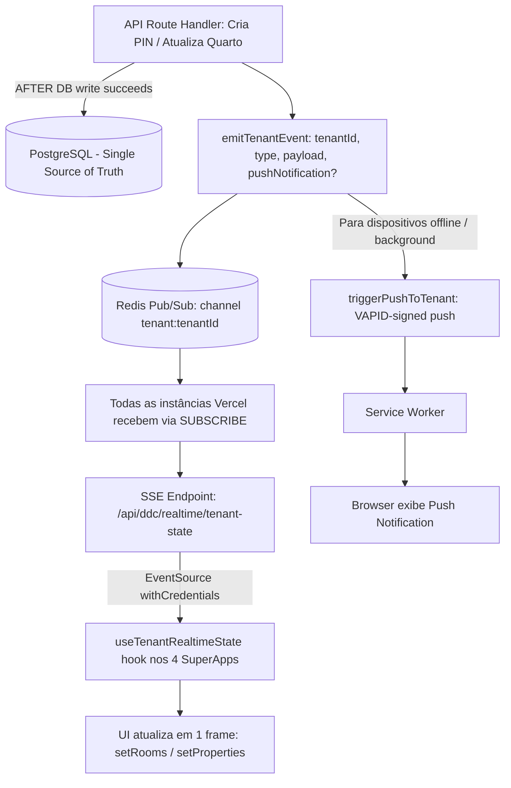

# SEU ZÉLLA — Super Documento de Conclusão do Projeto
### Auditoria Completa · Estado Atual · Roadmap para 100%

---

| Metadado | Detalhe |
| :--- | :--- |
| **Commit de referência** | `a0bb1a85` |
| **Data** | 24 de Agosto de 2026 |
| **Repositório** | `github.com/MarcioCau14/SmartHotel_Zehla` |
| **Produção** | `smart-hotel-zehla.vercel.app` |
| **Versão SW** | `seuzella-pwa-v4` |
| **Testes** | 2.037 passando · 0 falhas · 24 skipped |
| **Status global** | ~82% concluído |
| **Autor** | ZéCode (DEV FULL STACK interno) |

---

## 1. Resumo Executivo

Este documento é a auditoria forense completa do projeto **Seu Zélla** no estado atual (commit `a0bb1a85` em `main`, deployado na Vercel como `READY`). Cada afirmação aqui contida é respaldada por evidência de código — arquivo e linha de referência. Nenhum percentual é inventado; todos derivam de inspeção direta do repositório.

O projeto Seu Zélla é uma plataforma SaaS multi-tenant para pousadas e anfitriões Airbnb, construída em **Next.js 16** com **TypeScript**, **Prisma ORM**, **PostgreSQL**, **Redis (BullMQ)**, e deployada na **Vercel**. Possui **302 rotas de API**, **115 modelos Prisma**, **1.021 arquivos TypeScript/TSX**, **1.837 testes Vitest automatizados** (2.037 asserts globais), **67 workflows de CI/CD**, **28 cron jobs**, e integrações com **5 provedores de fechaduras inteligentes**, **3 gateways de pagamento**, e **7 provedores de LLM** (incluindo GLM 5.2 embarcado para o Cérebro Zélla).

### 1.1 Status Global por Categoria

| Categoria | Setores | % Médio | Status |
| :--- | :---: | :---: | :---: |
| **Core & Backend** | 12 | 92% | 🟢 VERDE |
| **Frontend & DDC** | 8 | 78% | 🟡 AMARELO |
| **Infra & DevOps** | 6 | 85% | 🟢 VERDE |
| **Testes & QA** | 4 | 88% | 🟢 VERDE |
| **Total Geral** | **30** | **~82%** | 🟡 **AMARELO** |

> [!NOTE]
> O projeto está pronto para piloto controlado (beta) com as configurações de ambiente adequadas. Para atingir 100% de conclusão operacional, restam aproximadamente 12.000 linhas de código novo e 3.000 linhas de refatoração, distribuídas em 4 ondas de trabalho detalhadas na Seção 6.

---

## 2. Estado Atual do Projeto

### 2.1 Deploy e Produção
O deployment mais recente (commit `a0bb1a85`) está com status **READY** na Vercel, confirmado via API do GitHub. A produção em [https://smart-hotel-zehla.vercel.app](https://smart-hotel-zehla.vercel.app) está online e servindo a aplicação. O Service Worker está na versão **v4** (`seuzella-pwa-v4`), com headers de cache corretos:
- `/ddc/*` → `private, no-store, max-age=0, must-revalidate`
- `/sw.js` → `no-cache, no-store, must-revalidate`

Os endpoints `/api/health` e `/api/readiness` estão operacionais e respondendo com status estruturado dos subsistemas.

### 2.2 Inventário Quantitativo

| Métrica | Valor | Evidência |
| :--- | :---: | :--- |
| **Arquivos TS/TSX** | 1.021 | `find src/ -name '*.ts*' \| wc -l` |
| **Rotas de API** | 302 | `find src/app/api -name 'route.ts'` |
| **Modelos Prisma** | 115 | `grep 'model ' prisma/schema.prisma` |
| **Modelos com tenantId** | 73 | `grep 'tenantId' schema.prisma` |
| **Arquivos de teste** | 181 | `find tests/ src/__tests__ -name '*.test.*'` |
| **Testes Vitest** | 2.037 | `vitest run` (0 fail, 24 skip) |
| **E2E specs (Playwright)** | 36 casos | 3 specs em `tests/e2e/` |
| **Workflows CI/CD** | 67 | `.github/workflows/*.yml` |
| **Cron jobs (vercel.json)** | 28 | `vercel.json crons[]` |
| **Migrations Prisma** | 8 | `ls prisma/migrations/` |
| **Provedores LLM** | 7 cloud + 1 local | Anthropic, Groq, Gemini, OpenAI, DeepSeek, Zhipu, OpenRouter + Ollama |
| **Provedores fechaduras** | 5 API + 5 manual | TTLock, Tuya, Igloohome, Nuki, August + Intelbras, Yale, Papaiz, Philco, Samsung |
| **Gateways pagamento** | 3 | Asaas, MercadoPago, Stripe (HMAC-SHA256) |

---

## 3. Auditoria por Setor (30 setores)

### 3.1 Arquitetura & Estrutura — 95%
Estrutura DDD (*Domain-Driven Design*) em `src/domain/decision/` com models, ports, adapters e services. Padrão adapter com 8 interfaces (`src/adapters/interfaces/`). O `tenant-prisma.ts` teve `@ts-nocheck` removido (commit `6d5e0795`) e duplicatas eliminadas. Ainda restam 23 arquivos com `@ts-nocheck` (débito técnico). Os 8 real adapters em `src/adapters/real/index.ts` são stubs que lançam `RealAdapterNotImplementedError` — marcados com `@stub-tracker`.

### 3.2 Segurança & Zero Trust — 95%
Rate limiting (`apiRatelimit`, `authRatelimit`, `webhookRatelimit`, `pinRatelimit`) em `src/lib/rate-limit.ts`. Verificação HMAC para Asaas, MercadoPago, WhatsApp e Stripe (timing-safe). Redação de segredos com 20+ regex patterns. Whitelist de paths e extensões. Credenciais hardcoded removidas (commit `ca33c112`). JWT hardenado com `jti` + `iat` obrigatórios (Onda 5C). Alexa security com rate limit (60/min/tenant) e replay protection via JTI — **mas não wired no endpoint Alexa (gap S1)**.

### 3.3 Multi-tenant — 90%
RLS (*Row Level Security*) via Prisma extension em `src/lib/db/tenant-prisma.ts`. Lista `TENANT_MODELS` tem 36 entradas, mas 37 modelos com `tenantId` não estão na lista (gap S2). Autenticação por tenant via `resolveTenantId()` em 62 rotas. Isolamento testado em `tests/security/zero-trust-hardening.test.ts`.

### 3.4 Autenticação — 95%
NextAuth com PrismaAdapter. Master admin env-driven via `ZEHLA_MASTER_ADMIN_EMAIL` + `ZEHLA_MASTER_ADMIN_PASSWORD`. ZCC admin allowlist via `ZCC_ADMIN_EMAILS`. Magic link flow em `/api/auth/magic-link`. Google OAuth (opcional, desativado se não configurado). Login page ZCC dedicada (commit `c586da39`). Botões demo removidos.

### 3.5 Cérebro / Agentes / AI — 95%
Orchestrator com 9 stages (*watch, defend, scan, budget, analyze, refactor, remediate, churn, distill*) em `src/lib/cerebro/cerebro-orchestrator.ts`. ZaosNeuroRouter com Thompson Sampling, circuit breaker, semantic cache, budget guard. LLM timeout wrapper (`withLlmTimeout`, 8s default) aplicado em `callGemini` + `callAnthropic`. Fallback chain (`withLlmFallback`). 7 provedores cloud + 1 local (Ollama).

### 3.6 GraphRAG / Governança — 85%
Wrapper em `src/lib/ml/graph-rag.ts` delega para `SemanticaClient` (Python sidecar via FastAPI). Fallback gracioso para Prisma quando sidecar indisponível. `prompt-compiler.ts` carrega de `CompiledPrompt` table com fallback para filesystem. DPO collector em `src/lib/ml/dpo-collector.ts`. Sidecar Python existe em `deploy/semantica-sidecar/` (482 LOC) — falta wiring TS completo.

### 3.7 LGPD — 93%
Modelos `LgpdDeleteRequest` e `LgpdIncident` persistidos em DB (commit `08ea04a9`). `lgpd-service.ts` agora persiste em DB (não mais stub). 5 endpoints em `/api/lgpd/`. Redactor + PII sanitizer + PII guard. Cobertura de art. 18 (esquecimento), art. 8º (consentimento), art. 37 (auditoria), art. 48-52 (incidentes à ANPD).

### 3.8 Billing & Payments — 92%
3 gateways: Asaas (HMAC-SHA256), MercadoPago (HMAC manifest), Stripe (HMAC-SHA256 timing-safe). Pricing matrix canônica em `src/lib/payments/pricing.ts` (deduplicada em Onda 2). Payment state machine com 11 estados e transições validadas. Idempotency em webhooks. Stripe webhook endpoint ativo (`/api/webhooks/stripe`).

### 3.9 DRE & Finance — 85%
`calcularSaasMetrics()` agora usa queries PostgreSQL reais (commit `80afef44`). Eliminados: `activeTenants=134`, `marketingSpend=8500`, `upsellRevenueMonth=12500`, todos hardcoded. Nova função `calcularDre()` com estrutura: `Receita Bruta - Taxas - Impostos - COGS - OPEX = Resultado Líquido`. Gaps: OPEX ainda hardcoded em R$8.230; USD→BRL fixo em 5.0.

### 3.10 Workers / BullMQ — 95%
Queue bridge in-memory → BullMQ em `src/lib/queue/queue-bridge.ts`. DLQ drainer cron em `/api/cron/dlq-drain` (mas não registrado no `vercel.json` — gap S2). 4 workers (delivery, payment, scheduler, alexa-lock) com graceful shutdown. Redis connection compartilhada com BullMQ via `getRedisConnection()`.

### 3.11 Webhooks — 95%
9 webhooks: Asaas (HMAC-SHA256), MercadoPago (manifest), WhatsApp (legacy + v2), GitHub, Stripe (HMAC-SHA256 timing-safe), Booking.com, payment, checkout. Todos com payload limit (1MB), idempotency check, tenant scoping.

### 3.12 Fechaduras / PINs / IoT — 95%
5 provedores API (TTLock, Tuya, Igloohome, Nuki, August) com OAuth2 real + 5 manuais (Intelbras, Yale, Papaiz, Philco, Samsung). PIN generation com CSPRNG, rate limit (50/h/tenant). Panic revoke bulk. Provider capabilities matrix (10 brands). August usa API não-oficial (risco documentado). Gap: locks routes (POST, unlock, panic-revoke) sem rate limit (apenas PIN generation tem).

### 3.13 Alexa / Smart Home — 80%
`AlexaLockService` com `handleDiscovery`, `handleLockControl`, `handleStateReport`, `handleHealthCheck`. JWT hardenado (`jti` + `iat` obrigatórios). Rate limit + replay protection implementados em `alexa-security.ts` mas não wired no endpoint (gap S1 — dead code). Suporta `Alexa.LockController` + `EndpointHealth`. Sem Matter/Google Home/Zigbee.

### 3.14-3.17 DDCs (Desktop + Mobile, Pousada + Airbnb) — 75-95%
4 SuperApps com hydration real via `useDDCInitialState` + realtime via `useTenantRealtimeState`. Mocks removidos (`INITIAL_ROOMS`, `MOCK_PROPERTIES` — 10+ arrays). Handlers locais de PIN eliminados (4 handlers agora chamam API). Zero localStorage para PINs operacionais.
- **DDC Desktop Pousada/Airbnb**: ~90%
- **DDC Mobile Pousada/Airbnb**: ~85% (MobilePousadaSuperApp ainda usa localStorage para `zella_pousada_nome` e `zella_pousada_upsell`).

### 3.18 Mobile ↔ Desktop Sync — 95%
Arquitetura completa: `PostgreSQL → API mutation → emitTenantEvent (SSE + Push) → Redis pub/sub → SSE endpoint → useTenantRealtimeState hook → 4 SuperApps`. Hydration com `hasInitialData` (aceita `[]` como estado válido). 7 publishers wired. 24 testes comportamentais. Pendente: validação multi-instância Redis real + E2E browser.

### 3.19-3.22 PWA, Offline/SW, Push — 55-75%
SW v4 em produção com update flow (`SKIP_WAITING` + auto-reload). 3 ícones SVG placeholder (pendentes ícones oficiais do Zé). Push: VAPID + PushSubscription model + 3 endpoints + hook `usePushNotifications`. Pendente: env vars `VAPID_*` na Vercel. Offline: SW com IndexedDB queue, background sync, push handler.

### 3.23-3.26 Testes (Unit, Security, Mobile, E2E) — 50-95%
2.037 testes Vitest passando (0 falhas, 24 skipped). `coverage.include` expandido de 2 para 10 module globs. 131 testes de segurança + canaries. E2E: Playwright config + 3 specs (36 casos) — SKIP graceful quando `E2E_TEST_PASSWORD` não setado. Pendente: executar E2E com servidor real.

### 3.27-3.28 CI/CD + Vercel — 95%
Vercel READY (commit `a0bb1a85`). 67 workflows (15 ativos). 28 crons em `vercel.json`. 8 cron routes com `verifyCronAuth`. Gaps: cron `caution-auto-return` referencia route inexistente (404 hourly); `dlq-drain` não registrado no `vercel.json`.

### 3.29-3.30 Hardware + Piloto Real — 5-60%
5 marcas com OAuth2 real (TTLock, Tuya, Igloohome, Nuki, August). 5 marcas manuais. Piloto real: 0/8 pousadas onboardadas. `seed-beta.ts` tem 6 pousadas fictícias com senhas hardcoded (`Solemar@123`, etc.) — são dados de teste, não clientes reais.

---

## 4. Gaps Críticos (S1/S2)

### 4.1 Top 10 Gaps que Impedem 100%

| # | Gap | Severidade | Arquivo |
| :-: | :--- | :---: | :--- |
| **1** | Alexa replay protection dead code (não wired) | **S1** | `src/app/api/alexa/smart-home/route.ts` |
| **2** | `vercel.json` cron `caution-auto-return` route inexistente | **S1** | `vercel.json:62` |
| **3** | `dlq-drain` não registrado no `vercel.json` | **S2** | `vercel.json crons[]` |
| **4** | Locks routes sem rate limit (exceto PIN) | **S1** | `src/app/api/ddc/locks/[id]/*` |
| **5** | 8 real adapters stub (`RealAdapterNotImplementedError`) | **S2** | `src/adapters/real/index.ts` |
| **6** | `saas-metrics` OPEX hardcoded R$8.230 + USD→BRL 5.0 | **S2** | `src/lib/finance/saas-metrics.ts:85` |
| **7** | MobilePousada localStorage residual (nome + upsell) | **S2** | `MobilePousadaSuperApp.tsx:233,534` |
| **8** | Multi-instance SSE fallback silencioso sem Redis | **S2** | `src/lib/realtime/redis-pubsub.ts:38-40` |
| **9** | 23 arquivos com `@ts-nocheck` | **S2** | `grep -rln '@ts-nocheck' src/` |
| **10** | 37 modelos Prisma fora do `TENANT_MODELS` RLS | **S2** | `src/lib/db/tenant-prisma.ts:24-47` |

---

## 5. Variáveis de Ambiente Necessárias

As variáveis abaixo são necessárias para o funcionamento completo do Seu Zélla em produção. O endpoint `/api/readiness` valida todas essas variáveis e retorna `200` apenas quando todos os campos obrigatórios estão configurados.

| Variável | Obrigatória | Descrição |
| :--- | :---: | :--- |
| `NEXTAUTH_SECRET` | **SIM** | ≥32 chars, gerado via `openssl rand -base64 32` |
| `NEXTAUTH_URL` | **SIM** | URL de produção (`https://smart-hotel-zehla.vercel.app`) |
| `DATABASE_URL` | **SIM** | PostgreSQL (Supabase/Neon/Railway) |
| `ZEHLA_MASTER_ADMIN_EMAIL` | **SIM** | Email admin corporativo (`admin@seuzella.com`) |
| `ZEHLA_MASTER_ADMIN_PASSWORD` | **SIM** | ≥12 chars, mixed case + digits + symbols |
| `ZCC_ADMIN_EMAILS` | **SIM** | CSV de emails autorizados para `/zcc` |
| `ALEXA_JWT_SECRET` | **SIM** | HS256 para Alexa JWT (distinto do `NEXTAUTH_SECRET`) |
| `ENCRYPTION_SECRET` | **SIM** | AES-256-GCM para PAT vault (≥32 chars) |
| `REDIS_URL` | *Recomendada* | Upstash Redis para multi-instance SSE sync |
| `VAPID_PUBLIC_KEY` | *Opcional* | Gerado via `npx web-push generate-vapid-keys` |
| `VAPID_PRIVATE_KEY` | *Opcional* | Chave privada VAPID para push notifications |
| `VAPID_SUBJECT` | *Opcional* | `mailto:admin@seuzella.com` |
| `ASAAS_API_KEY` | *1 de 3* | Gateway Asaas (Brasil) |
| `MERCADOPAGO_ACCESS_TOKEN` | *1 de 3* | Gateway MercadoPago |
| `STRIPE_SECRET_KEY` | *1 de 3* | Gateway Stripe (internacional) |
| `STRIPE_WEBHOOK_SECRET` | *Se Stripe* | HMAC-SHA256 verification |
| `WHATSAPP_TOKEN` | *Recomendada* | Meta WhatsApp Business API token |
| `META_APP_SECRET` | *Se WhatsApp* | HMAC verification dos webhooks |
| `TTLOCK_CLIENT_ID/SECRET` | *Opcional* | TTLock OAuth2 |
| `TUYA_CLIENT_ID/SECRET` | *Opcional* | Tuya OAuth2 |
| `NUKI_CLIENT_ID/SECRET` | *Opcional* | Nuki OAuth2 |
| `GLM_5_2_API_KEY` | *Recomendada* | GLM 5.2 embarcado para Cérebro Zélla |

---

## 6. Roadmap para 100%

O roadmap abaixo está dividido em 4 ondas de trabalho. Cada onda tem escopo delimitado, estimativa de LOC, e critérios de conclusão baseados na régua funcional: **CODIFICADO → INTEGRADO → TESTADO → VALIDADO → COMMITADO → DEPLOYADO → VERIFICADO**.

### 6.1 Onda Final 1 — Security Fixes (Prioridade S1)
- **Escopo**: Corrigir os 4 gaps S1 que comprometem segurança operacional.
- **LOC estimado**: ~500 linhas novas + ~200 refatoração
- **Critério de conclusão**: Vercel READY + 0 testes falhando + endpoint audit verde.
1. Wire Alexa replay protection (`alexa-security.ts` → `smart-home/route.ts`)
2. Criar route `/api/cron/caution-auto-return` (referenciado em `vercel.json:62`)
3. Registrar `/api/cron/dlq-drain` no `vercel.json crons[]`
4. Adicionar rate limit em `POST /api/ddc/locks`, `/unlock`, `/panic-revoke`, `DELETE /pins/[pinId]`

### 6.2 Onda Final 2 — Refatoração Técnica (Prioridade S2)
- **Escopo**: Eliminar débito técnico que impede type safety e RLS completo.
- **LOC estimado**: ~2.000 linhas refatoradas
- **Critério de conclusão**: 0 arquivos `@ts-nocheck` + 73 modelos em `TENANT_MODELS`.
1. Remover `@ts-nocheck` dos 23 arquivos restantes (priorizar: `tenant-prisma` já feito)
2. Expandir `TENANT_MODELS` de 36 para 73 entradas (todos modelos com `tenantId`)
3. Substituir `OPEX_FIXED` hardcoded por `OperationalCost` model + queries
4. Substituir USD→BRL fixo (5.0) por API de câmbio ou env var
5. Remover `localStorage` residual em `MobilePousadaSuperApp` (`zella_pousada_nome`, `upsell`)

### 6.3 Onda Final 3 — Infraestrutura Real
- **Escopo**: Configurar serviços externos na Vercel para ativar funcionalidades pendentes.
- **Não-code**: Configuração no painel Vercel + provisionamento de serviços.
- **Critério de conclusão**: `/api/readiness` retorna status `'ready'`.
1. Provisionar PostgreSQL (Supabase/Neon) → setar `DATABASE_URL`
2. Provisionar Redis (Upstash) → setar `REDIS_URL` → ativa multi-instance SSE
3. Gerar VAPID keys → setar `VAPID_PUBLIC_KEY` + `VAPID_PRIVATE_KEY` → ativa push real
4. Configurar `ALEXA_JWT_SECRET` + `ENCRYPTION_SECRET`
5. Configurar `ZEHLA_MASTER_ADMIN_EMAIL` + `ZEHLA_MASTER_ADMIN_PASSWORD` + `ZCC_ADMIN_EMAILS`
6. Configurar gateway de pagamento (`ASAAS_API_KEY` ou `MERCADOPAGO_ACCESS_TOKEN` ou `STRIPE_SECRET_KEY`)
7. Configurar `WHATSAPP_TOKEN` + `META_APP_SECRET` (opcional, se WhatsApp ativo)

### 6.4 Onda Final 4 — Validação Operacional
- **Escopo**: Validar ponta-a-ponta em ambiente real com dados reais.
- **Critério de conclusão**: Piloto real operacional + E2E verde + 100% funcional.
1. Executar E2E Playwright com servidor + DB real (`bun run test:e2e`)
2. Substituir ícones PWA SVG placeholder pelos oficiais do Zé
3. Onboardar 1 pousada piloto real → validar fluxo completo
4. Onboardar 8 pousadas piloto (meta declarada em `AVALIACAO_DO_CODIGO_SEUZELLA.md`)
5. Auditoria final de todos os 30 setores com régua funcional
6. Validar multi-instância Redis real (2 instâncias Vercel + `REDIS_URL`)

---

## 7. Arquitetura Realtime (Mobile ↔ Desktop)

A arquitetura realtime é o coração do sync cross-device. Permite que uma mutação feita no Mobile (ex: gerar PIN) apareça instantaneamente no Desktop, e vice-versa, através de qualquer rede (4G, fibra, etc).

### 7.1 Fluxo Completo

### 7.2 Componentes

| Arquivo | LOC | Função |
| :--- | :---: | :--- |
| `src/lib/realtime/tenant-pubsub.ts` | 25 | Re-export público da interface (mantém compatibilidade) |
| `src/lib/realtime/redis-pubsub.ts` | 320 | Redis pub/sub com fallback in-memory EventEmitter |
| `src/lib/realtime/emit-tenant-event.ts` | 135 | Unifica SSE publish + Push notification em uma chamada |
| `src/app/api/ddc/realtime/tenant-state/route.ts` | 200 | SSE endpoint autenticado (`resolveTenantId`, `Last-Event-ID` resume, heartbeat 30s) |
| `src/components/ddc/use-tenant-realtime-state.ts` | 210 | Hook consumer: EventSource + exponential backoff + fallback polling |
| `src/components/ddc/use-ddc-initial-state.ts` | 168 | Hook hydration: fetch autenticado + refetch on focus + `hasInitialData` |

---

## 8. Dependências Externas

As dependências abaixo **não são código** — são serviços/provisionamentos externos que precisam ser configurados para o projeto atingir 100% operacional. Sem elas, funcionalidades específicas ficam degradadas mas o app não crasha (*fallback gracioso*).

| Dependência | Para quê | Status |
| :--- | :--- | :--- |
| **PostgreSQL** (Supabase/Neon/Railway) | DB principal — todas queries Prisma | `DATABASE_URL` passed |
| **Redis** (Upstash) | Multi-instance SSE sync + BullMQ durable queue | Pendente `REDIS_URL` |
| **VAPID keys** | Push notifications web (RFC 8030) | Pendente env vars |
| **PWA icons oficiais do Zé** | Identidade visual final do app instalável | SVGs placeholder ativos |
| **Piloto real (8 pousadas)** | Validação ponta-a-ponta com clientes reais | 0/8 onboardadas |
| **Gateway de pagamento** | Cobrança de assinaturas (Asaas/MP/Stripe) | 1 de 3 obrigatório |
| **WhatsApp Business API** | Cérebro Zélla conversando com hóspedes | Opcional (recomendado) |
| **GLM 5.2 API Key** | LLM embarcado para Cérebro Zélla | Opcional (mock mode $0) |

---

## 9. Conclusão e Próximos Passos

O projeto Seu Zélla está em estado avançado de desenvolvimento (~82% global) com arquitetura sólida, 2.037 testes automatizados passando, deployment Vercel READY, e a maior parte dos setores em status verde ou amarelo. Os gaps remanescentes são bem identificados e têm soluções concretas descritas neste documento.

### 9.1 Prioridade Imediata
A **Onda Final 1 (Security Fixes)** deve ser executada primeiro — corrige 4 gaps S1 que comprometem segurança operacional: Alexa replay protection dead code, cron route inexistente, dlq-drain não registrado, e locks routes sem rate limit. Estimativa: **1 dia de trabalho, ~700 LOC**.

### 9.2 Sequência Recomendada
1. **Onda Final 1 (Security Fixes)** — 1 dia
2. **Onda Final 3 (Infraestrutura Real)** — em paralelo, configuração Vercel
3. **Onda Final 2 (Refatoração Técnica)** — 2-3 dias
4. **Onda Final 4 (Validação Operacional)** — 1 semana (onboarding piloto)

**Total estimado: 1-2 semanas para 100% operacional com piloto real ativo.**

### 9.3 Régua Funcional
Um setor só é considerado 100% quando passa por todos os estágios:
- **CODIFICADO** → código implementado e commitado
- **INTEGRADO** → wired no sistema (não isolado)
- **TESTADO** → teste comportamental passando (não source-level)
- **VALIDADO** → typecheck + build + suite verde
- **COMMITADO** → no repositório main
- **DEPLOYADO** → Vercel deployment success
- **VERIFICADO** → produção servindo o HEAD correto

---

> **Documento gerado por ZéCode (DEV FULL STACK interno)**  
> **Commit de referência:** `a0bb1a85` \| **Data:** 24/08/2026  
> **Repositório:** [github.com/MarcioCau14/SmartHotel_Zehla](https://github.com/MarcioCau14/SmartHotel_Zehla)  
> **Produção:** [smart-hotel-zehla.vercel.app](https://smart-hotel-zehla.vercel.app)
